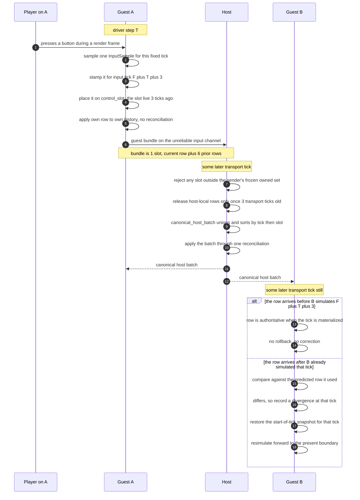
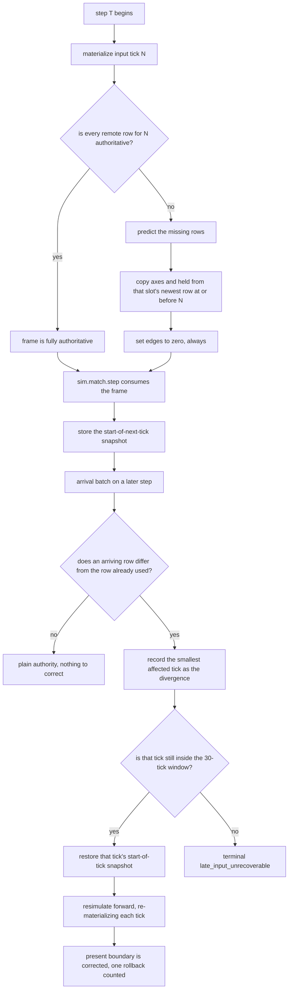
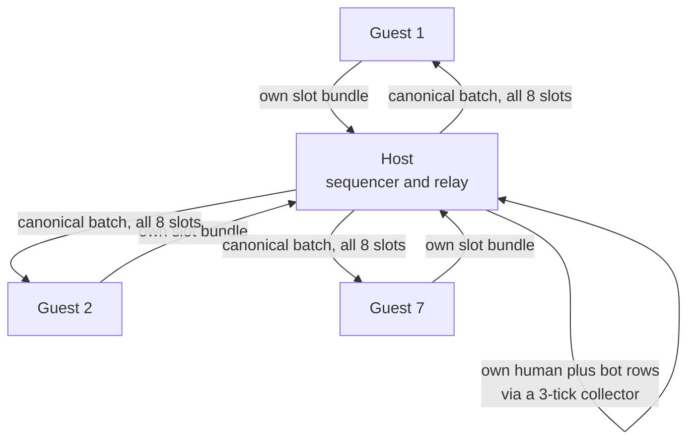
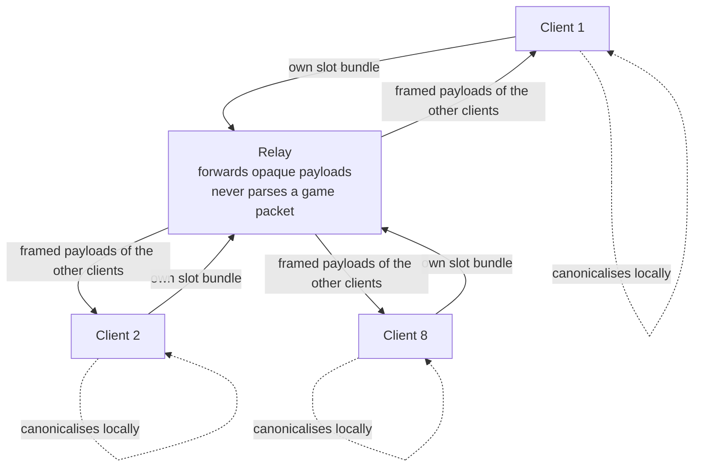

# Network architecture: how the transport and the rollback fit together

This document explains how an online match actually works end to end: where a
button press goes, what every other client does with it, why each client can run
ahead of the network without the match falling apart, and why the design is fair
even though no two players learn anything at the same moment.

It assumes you know what rollback netcode is for. It does **not** assume you know
this codebase, and it deliberately describes *this* implementation rather than
the generic shape. Every claim below names the file and constant it comes from so
you can check it.

Related documents, in the order they become useful:
[`fixed_tick.md`](fixed_tick.md) for the simulation clock,
[`input_frame.md`](input_frame.md) for the sample shape,
[`rollback_policy.md`](rollback_policy.md) for prediction and confirmation rules,
[`input_packets.md`](input_packets.md) for the wire format,
[`match_driver.md`](match_driver.md) for the controller that ties them together,
and [`relay_topology_decision.md`](relay_topology_decision.md) for the accepted
decision to move off the host-star in OMP-4.

## The constants, in one place

| Constant | Value | Defined in |
| --- | --- | --- |
| `fixed_clock.TICK_RATE` | `60` | `sim/fixed_clock.lua:25` |
| `fixed_clock.TICK_SECONDS` | `1 / 60` | `sim/fixed_clock.lua:26` |
| `input_frame.SLOT_COUNT` | `8` — four home, four away | `sim/input_frame.lua:78-80` |
| `input_protocol.FAIRNESS_DELAY_TICKS` | `3` — 50 ms of input delay | `game/online/input_protocol.lua:74` |
| `input_protocol.HISTORY_ROWS` | `6` prior rows of redundancy | `game/online/input_protocol.lua:72` |
| `input_protocol.RETAINED_ROWS` | `7` = `HISTORY_ROWS + 1`, the redundancy window | `game/online/input_protocol.lua:73` |
| `input_protocol.MAX_GUEST_ROWS` | `7` = `RETAINED_ROWS` — one slot, seven ticks | `game/online/input_protocol.lua:75` |
| `input_protocol.MAX_HOST_ROWS` | `72` = `SLOT_COUNT * HOST_WINDOW_ROWS`, sized to the byte budget (#243) | `game/online/input_protocol.lua` |
| `rollback_input_history.ROLLBACK_WINDOW_TICKS` | `30` ticks = 500 ms | `sim/rollback_input_history.lua:86` |
| `contract.MAX_GUESTS` | `7`, so one star is at most 1 + 7 endpoints | `game/transport/contract.lua:165` |
| `contract.MAX_PAYLOAD_BYTES` | `1280` per transport message, raised from `1024` by #316 for the ten-byte input record | `game/transport/contract.lua` |
| `input_frame.MAX_SAMPLE_WIRE_BYTES` | `10` ASCII bytes = five sample bytes, including aim (#316) | `sim/input_frame.lua` |
| `match_driver.SETTLE_TIMEOUT_TICKS` / `_SECONDS` | `60` / `2`, the only bounds on the settle phase (#255) | `game/online/match_driver.lua` |

A note on match length, because it used to be quoted inconsistently. A match is
**120 seconds — 7,200 ticks** — everywhere: `sim.match` (`sim/match.lua:958`),
the OMP-1 determinism fixture (`data/omp1_determinism.lua:34`), the protocol
conformance fixture (`game/online/protocol_fixture.lua:118`), and the
content-derived online manifest
(`match_manifest.DEFAULT_DURATION_TICKS = 7200`). That last one said `3600` when
this document was first written, which is what raised
[#251](https://github.com/osobytes/goliseo/issues/251); it was a divergence
nobody had chosen and is now resolved in favour of 120 seconds. The decision and
its reasoning are recorded in [`match_flow.md`](match_flow.md#a-match-is-120-seconds-online-and-offline).
The bandwidth arithmetic in the relay decision record is stated over a
120-second, 7,200-tick match and is therefore consistent with this. Nothing in
this document ever depended on which value was right — the per-tick figures are
identical either way.

## Three clocks

Everything below is easier once these are separated. They are separated in the
code too (`game/online/match_driver.lua:13-28`).

| Clock | Meaning |
| --- | --- |
| **driver step `T`** | One `match_driver.advance` call. One 60 Hz frame. |
| **transport tick** | `T + 3` on the wire. Exists only so the host's own bundles can spend the fairness delay in its collector before the first simulated tick. |
| **input tick** | `first_input_tick + T`. The authority tick `sim.match.step` consumes during step `T`. |

The rule that matters, and the one the whole fairness argument rests on:

> **A sample taken during driver step `T` is authority for input tick
> `first_input_tick + T + 3`.**

The sample is stamped for a tick in its own future *before it is sent*
(`match_driver.advance` authors `input_tick + DELAY_TICKS`,
`game/online/match_driver.lua:1891-1898`). Nothing downstream ever re-derives an
input tick from a transport tick — `input_packets.md` states that as a protocol
invariant, and the wire carries both numbers separately.

The first three input ticks of every match carry neutral human rows on every
peer, because nobody had sampled anything before the start boundary
(`game/online/match_driver.lua:1546-1559`).

## 1. The journey of one input

A player on guest A presses shoot. Here is where it goes.



Step by step, with the code:

1. **Sampled at a fixed tick.** Render-rate input is folded into exactly one
   canonical `InputSample` per simulation tick. The sample is four bytes: two
   signed axes, a held mask, and an edge mask (`input_packets.md`, "Canonical
   sample and row encoding"). Discrete actions are *edges*, which is why they can
   never be duplicated by prediction.
2. **Stamped for a tick.** `advance` authors for `input_tick + 3`
   (`game/online/match_driver.lua:1891-1898`). The row also has to name a slot:
   `control_slot(N) = live(N - 3)` (`game/online/match_driver.lua:516-520`),
   because the slot the player was steering when they pressed the button is the
   slot the press belongs to.
3. **Bundled with redundancy.** A guest bundle contains that slot's rows from
   `max(first_input_tick, N - 6)` through `N`, oldest first — seven rows at steady
   state (`redundant_rows`, `game/online/match_driver.lua:563-572`; bound
   `MAX_GUEST_ROWS = 7`). The input channel is **unordered and never retransmits**
   (`contract.CHANNEL_CONFIG`, `game/transport/contract.lua:176-179`), so this
   window *is* the loss recovery: up to six consecutive lost emissions are
   recovered by the next packet that lands.
4. **Applied locally, immediately.** A guest inserts its own rows into its own
   history in the same step, as a batch, with no reconciliation pass
   (`game/online/match_driver.lua:1779-1788`). Its own slots are declared `local`
   sources (`game/online/match_driver.lua:1663-1667`) and a `local` row must be
   authoritative before the tick is materialized — missing local input fails loudly
   rather than being predicted (`sim/rollback_input_history.lua:516-519`). **No
   peer ever predicts its own input.**
5. **Aggregated by the host.** The host polls every envelope available on one
   transport tick, checks each sender against its frozen owned set, adds its own
   collector bundles that have come due, and produces exactly one canonical batch
   through `input_protocol.canonical_host_batch`
   (`game/online/input_protocol.lua:864-1014`). That function unions rows by
   `(slot, input tick)`, rejects any conflicting sample rather than picking a
   winner, sorts by `(input tick, slot)`, and emits one host packet.
6. **Fanned back out.** One batch, broadcast to every guest, bounded at
   `MAX_HOST_ROWS = 72` rows — eight slots times a nine-tick window, sized to the
   wire budget by #243 rather than to the guest's own retained window. That budget
   moved to 1,280 bytes in #316, which raised the transport bound rather than cut
   the window to pay for the aim sample byte.
   Steady state is 56 of those rows; the remainder is headroom the host spends
   re-sending the ticks a lagging guest has *reported* it is still missing. Note
   that the batch carries **all eight slots, including the recipient's own rows**;
   a guest de-duplicates them as byte-identical repeats.
7. **Applied on other clients.** A guest decodes every host batch on the step,
   unions the rows, sorts them canonically, and applies them as one atomic batch
   through `rollback_session.apply_authoritative_batch`, which reconciles **exactly
   once** (`game/online/match_driver.lua:1178-1238`). Poll order is recorded and
   never used as authority.
8. **Arriving late.** If the tick has already been simulated with a predicted row
   and the real row differs, that is a *divergence* — section 2.

The host is a **sequencer, not a simulation authority**. It copies valid sample
bytes; it cannot change a guest's row, claim another producer's slot, fill a
missing slot, or decide an outcome (`input_packets.md`, "Host collection and
ownership"). Authorship is a frozen partition of the eight slots, so two peers can
never author the same `(slot, input tick)` — a conflict is a detectable fault, not
a race.

### The bounded batch, and what happens when it overflows

A burst wider than 56 rows does not fit in one batch. The excess is **carried to
the next transport tick** rather than dropped, selected deterministically by
`(host-local first, transport tick, sender, sequence)` and then taken greedily
(`select_within_bound`, `game/online/match_driver.lua:961-1002`). The host also
tops the batch up, inside the remaining budget, from the newest bundle it holds
per slot, so a loss on the guest→host leg does not multiply into the host→guest
leg (`remember_relay` / `fill_relay_window`,
`game/online/match_driver.lua:1004-1100`).

That repairs the leak, not the bound. Saturation under the `stress` profile is
still open as **#243**, and the failure it causes is real: a row that gets fewer
fan-outs than the redundancy window promises can be lost permanently by a guest,
which then cannot confirm past it.

## 2. How a client runs rollback against the agreed input stream

Every client runs the identical deterministic simulation over the identical input
stream. The only thing that differs between clients is *when* each row of that
stream arrives, and therefore how much guessing each client had to do in the
meantime.

`sim.rollback_session` is the coordinator (`sim/rollback_session.lua`). It owns
two bounded histories: `sim.rollback_input_history` for input rows and
`sim.rollback_snapshot_history` for start-of-tick snapshots.



### Prediction

For each missing **remote** row on tick `N`, the history searches that slot's
authoritative history at or before `N`, takes the greatest tick found, copies
`move_x`, `move_y`, `held` and `aim`, and sets `edges` to zero unconditionally
(`sim/rollback_input_history.lua`). Aim repeats with `held` rather than resetting
with `edges` because it is a continuous channel: "still aiming where they last
aimed" is the same prediction "still holding what they last held" already makes. With no prior sample at all it uses a
fully neutral sample.

Zeroing edges is the important part. Shoot, pass, switch, dash, dodge, and the two
equipment edges fire **only** on the tick whose authoritative row carries them. A
delayed or lost edge can never become sticky or repeat across predicted ticks.
Movement and held intent persist; discrete actions do not. Predictions also chain
from the latest *authoritative* sample, never from another prediction, and a
future out-of-order arrival is never used to predict an earlier tick.

### Divergence

An arrival is a divergence only if it differs from the row **already materialized
and used** for that same tick and slot. An identical prediction is not a
divergence, and authority for a tick that has not been simulated yet is just
authority. Across a batch of differing arrivals the history retains the smallest
affected tick, so one batch causes at most one restore
(`rollback_policy.md`, "Divergence and resimulation handoff").

### Restore and resimulate

`reconcile_changed` (`sim/rollback_session.lua:630-733`) consumes the divergence,
restores that boundary's snapshot, and replays forward to the old present,
re-materializing every replayed tick so each one picks up any corrected rows in
the same pass. It then records the depth as
`old_present_boundary - causal_tick`.

Snapshot history holds the present boundary plus the preceding 30 — exactly 31
ring positions. If corrected play *finishes earlier* than the old present, the
session stores the final boundary, truncates snapshots strictly after it, and
truncates effective input records at or after it. The retention floors only ever
move forward.

### The retained window, and arriving older than it

The window is `ROLLBACK_WINDOW_TICKS = 30` input ticks — exactly 500 ms at 60 Hz
(`sim/rollback_input_history.lua:86-89`). Two distinct things happen at that edge:

- A valid authoritative row arriving **below the retained floor** is rejected with
  the recoverable `outside_window` result and changes nothing
  (`sim/rollback_input_history.lua:335-341`).
- A divergence whose restore boundary is outside the window puts the session into
  terminal `late_input_unrecoverable` (`sim/rollback_session.lua:632-638`). It does
  not clamp the tick, invent a snapshot, or silently ignore the correction.

`rollback_policy.md` is explicit that 30 ticks is a laboratory decision made to
keep memory, CPU, and failure behaviour measurable — **not** a promise about real
internet latency.

There is a third, quieter failure that is worth knowing about because it is the
one that actually bit. Confirmation — the greatest contiguous tick for which all
eight slots are authoritative — only ever advances from `confirmed_tick + 1`. If a
tick loses its eighth row to the retained floor before that row arrives,
confirmation can never cross the hole again, for the rest of the match. The driver
now checks `confirmed_tick + 1 < oldest_retained_tick` at the end of every
`advance` and terminates `confirmation_stalled`
(`match_driver.md`, "Confirmation liveness is checked, not inferred"). Before that
check existed, the peer kept simulating on authority it would never confirm and
surfaced ~60 steps later as a completely different fault. That is #241.

## 3. The two topologies

### Current: host-star (OMP-3, shipped)

One host endpoint, up to seven guest links (`contract.MAX_GUESTS = 7`). Each link
carries two channels: a reliable ordered control channel for the session
coordinator, and an unordered, never-retransmitting input channel for bundles and
batches (`game/transport/contract.lua:176-179`). Everything transport-shaped
enters the game through the injected `StarTransportAdapter`
(`game/transport/contract.lua:123-144`); `game/transport/fake_star.lua` is the
in-process reference implementation and `browser_star.lua` the WebRTC one.



Properties that follow from the shape:

- The host's uplink carries the whole match. The relay decision measures the
  worst-node upload at **5,285 B/tick** for the host against **1,190 B/tick** for a
  client — roughly 2.5 Mbps sustained upload from a residential connection,
  belonging to somebody who is also playing.
- A guest's input reaches another guest in **two legs**; it reaches the host in
  **one**.
- Seven NAT-traversal pairs, any of which can fail.
- The host leaving ends the session. The settle phase exists partly because of
  this: the host is the star's relay, so it stays until its own final boundary is
  confirmed *and* every author it has heard from has reported confirming that
  boundary too, bounded either way by the settle deadline
  (`match_driver.md`, "The host is the star's relay, so it leaves last"). Until
  #255 it could also leave after four consecutive settle steps with no inbound
  input traffic; that escape is retired, and reports are now the only evidence it
  acts on.

### Decided: dedicated relay (OMP-4, accepted, not built)

Accepted by the repository owner on 2026-07-27. See
[`relay_topology_decision.md`](relay_topology_decision.md) for the full reasoning
and the rejected alternatives; it is not restated here. The build is tracked by
**#246** and validated in-harness first by **#245**.



What changes:

- **No peer is the sequencer.** Every client sends one hop to the relay and
  receives every other client's input two hops back. All eight occupy the identical
  structural position.
- **The relay never parses a game packet.** It concatenates the opaque payloads it
  received this tick and frames them onward. Canonicalisation stays client-side, in
  the Lua that is already written and already has pinned conformance goldens —
  reimplementing `canonical_host_batch` in another language is how desyncs are made.
- **A client never receives its own rows echoed back**, unlike today's canonical
  batch.
- `MAX_HOST_ROWS` saturation has no analogue, because there is no eight-slot
  aggregation into one bounded packet. #243 is expected to disappear structurally —
  #245 exists to confirm that rather than assume it.
- `StarTransportAdapter` is already the seam. A relay adapter becomes a third
  implementation alongside `fake_star` and `browser_star`, and the driver above it
  does not change. `request_offer`, `accept_offer`, `accept_answer`, `take_signal`
  and `ice_state` leave the game-facing path.

What does **not** change: the session coordinator stays client-side on the room
creator, so host departure still ends the session (host migration is OMP-5). The
manual-connect host-star is retained for LAN and no-infrastructure play, so both
topologies coexist rather than one replacing the other.

## 4. Fairness

### The conceptual key: fairness is about ticks, not wall clock

This is the thing that makes the design fair, and it is not obvious.

**An input is stamped for a target simulation tick before it is sent.** Every
client applies it at that same tick — rolling back if it had predicted otherwise —
and no client applies it at any other tick. So the question "whose input took
effect first?" has a single answer that is the same on every machine, and it is
answered in *game time*, not wall-clock time.

Clients absolutely do learn of remote inputs at different wall-clock moments. A
client near the host learns of a row milliseconds before a client far from it.
That difference changes **how much each client had to guess** in the interim. It
does not change **which tick the row lands on**, because that was decided by the
author before the packet left, and it is carried explicitly on the wire
(`input_packets.md`: every authority row carries its own simulation input tick, and
no input tick is ever derived from a transport tick).

Concretely: player A on a 10 ms connection and player B on a 90 ms connection both
press shoot during driver step 400. Both stamp their sample for input tick
`first + 403`. Both shots resolve on input tick `first + 403` on every one of the
eight clients. B's shot is not late in game time. What is different is that other
clients had B's row later in wall clock, so more of them predicted tick 403 without
it and had to roll back once it arrived. The simulation outcome is identical.

### Why a client applies its own input immediately

A guest inserts its own rows into its own history on the step it authors them,
three ticks before the tick they are stamped for, without waiting for the host's
echo (`game/online/match_driver.lua:1779-1788`). The host does the same thing
through its collector, arriving at the same place by a different route (below).

Waiting for the echo would add a **full round trip to your own actions** — you
would press shoot and see nothing until the packet had reached the host and come
back. It would also be pointless: the tick stamp already guarantees that every
client applies the row at tick `N`, so there is nothing about the echo that could
change where your own input lands. The echo carries no new information about your
own rows. That is why the host's re-sent copy of a guest's row is a byte-identical
duplicate and is simply idempotent.

This is also why local input never needs prediction. A peer's own slots are
`local` sources, and a `local` row must be authoritative before its tick is
materialized — the history fails loudly rather than predicting one
(`sim/rollback_input_history.lua:516-519`).

### Today: the host is the sequencer, and what the delay actually compensates

The host does have a structural advantage. Its own input reaches the canonical
stream with no network hop, and it holds the complete canonical stream one leg
before any guest does, so it predicts less, rolls back less, and confirms earlier.
#241's tail stall is the concrete evidence: the host reached full time and
terminated first *because* as sequencer it confirms first, and the guests it left
behind could no longer obtain the rows they were missing.

`FAIRNESS_DELAY_TICKS = 3` is the compensation. It is worth being precise about
what it does, because the obvious reading is broader than the mechanism.

**One. It is the input delay itself.** A sample taken during step `T` is authority
for input tick `first + T + 3` (`game/online/match_driver.lua:1891-1898`). Those
three ticks — 50 ms — are the delivery budget in which the sample must reach every
other client before that client has to predict it.

**Two. It forces the host through the same delay, as a protocol invariant.** The
host does *not* insert its own rows into its own history. It queues them in a local
collector with `due = step + DELAY_TICKS`
(`game/online/match_driver.lua:1755-1760`) and reads them back only once due
(`collect_arrivals`, `game/online/match_driver.lua:906-921`). Independently of
that, `canonical_host_batch` **refuses** any arrival on the host's own transport
link that has spent fewer than three transport ticks in the collector:

```lua
if
    arrival.transport_peer_id == options.host_peer_id
    and arrival.arrival_tick - packet.transport_tick
        < input_protocol.FAIRNESS_DELAY_TICKS
then
    return failure("fairness_delay", "host-local input bypassed the fixed fairness delay")
end
```

— `game/online/input_protocol.lua:965-971`. The packet also carries
`input_delay_ticks` on the wire, and decoding rejects any value other than
`FAIRNESS_DELAY_TICKS` (`game/online/input_protocol.lua:442-444`). So the sequencer
cannot shorten its own input latency, by accident or on purpose, without failing
its own validator.

The arithmetic lands exactly on the boundary. A host row authored at step `T` has
`transport_tick = T + 3` and becomes due at step `T + 3`, where
`arrival_tick = (T + 3) + 3 = T + 6`, so `arrival_tick - transport_tick == 3` —
the minimum the gate permits. And step `T + 3` is precisely the step that simulates
input tick `first + T + 3`, the tick the row is stamped for. The host's own input
therefore becomes authoritative in its own history on exactly the step that
consumes it: never earlier, which would be an advantage, and never later, which
would make the host predict its own input.

**Three. `control_slot(N) = live(N - 3)`** (`game/online/match_driver.lua:516-520`)
is the bookkeeping the delay forces, not a second compensation. Because a sample is
authority three ticks after it is taken, the row that carries a human's bits at
input tick `N` is the one for the slot that was live three ticks earlier — the slot
they were actually steering when they pressed. It is a pure function of the same
timeline, so every peer computes it, not only the author. The `switch` edge is read
from that same row for the same reason: reading `live(N)`'s row would read an AI row
whenever the two differ, and switching would silently stall.

**What the delay does not do — and this is the part worth reading twice.** It does
not equalise confirmation depth. Assume every wire leg costs the same. A guest's row
reaches the host in one leg and another guest in two. The same three-tick budget is
therefore spent **once** on the host's inbound path and **twice** on a guest's. With
identical latency the host has strictly more of its remote rows inside the budget,
so it predicts less, rolls back less, and confirms earlier.

So `FAIRNESS_DELAY_TICKS` cancels the *responsiveness* half of the host's structural
position — the host's own button press takes effect exactly as many ticks later as
any guest's — and leaves the *confirmation-depth* half untouched. The settle phase
and its host-only relay wait exist to work around the untouched half: the host
confirms first by construction, so "confirmed, therefore done" made it leave first,
every time, stranding guests that were still asking it to relay. Since #243 that wait
reads each guest's reported confirmation directly, and since #255 that is *all* it
reads: the four-step `SETTLE_RELAY_QUIET_STEPS` window is retired, because silence
could only ever override a peer's own report rather than substitute for a missing
one. See
[match driver](match_driver.md#silence-never-pre-empts-a-peers-own-report-255).

Two further caveats on the value itself. Three ticks is a **fixed** guess: a guest
100 ms away is under-compensated and one 10 ms away is over-compensated, so this is
approximate fairness by construction. And the decision record characterises the 50 ms
as a guess at guest-to-host latency; on the reading above it is more accurately the
budget for the whole guest→host→guest path, which is exactly why it covers a guest's
inbound path less well than the host's. Treat the exact framing as contested and the
mechanism above as the checkable fact.

### Under the relay: nothing left to compensate

With a framing relay there is no sequencer. Every client sends one hop to the relay
and receives every other client's input two hops back, so the "one leg for me, two
legs for you" asymmetry above simply does not exist. All eight clients occupy the
identical structural position, and fairness stops being something the protocol
patches — it becomes a property of the shape.

The constant will probably survive, but its justification changes: from "compensate
a privileged player" to "a uniform input-delay knob trading responsiveness against
rollback frequency", which is how rollback games normally tune it. **#249** tracks
retuning or removing it, and explicitly requires that it not silently persist as dead
compensation. Its value deserves revisiting once it is no longer doing double duty;
#249 says to decide it with the #169 fault harness rather than intuition.

### What remains: geography

A client 10 ms from the relay still has an advantage over one at 80 ms. That does not
go away. Be precise about what kind of advantage it is:

- **It is a smoothness and correction-depth difference.** The near client has more
  remote rows arriving inside the three-tick budget, so it predicts fewer rows, rolls
  back less often, and rolls back less deeply when it does. Its picture of the match
  is corrected less visibly.
- **It is not a mechanical difference.** The input stream is the same stream, every
  row is stamped for the same tick, and the simulation is deterministic. Both clients
  converge to the identical state at every confirmed boundary and to the identical
  final result. The far client is not playing a different match, and its inputs do not
  land later in game time.

The reason this is a *better* shape of unfairness than the current one is that
geographic advantage is fixable by **placement** — put the relay near the players'
centroid, or let the room choose a region — while structural advantage is fixable only
by compensation. And it is symmetric in kind: everyone has the same relationship to the
relay and differs only in distance, rather than one player having a categorically
different relationship to it.

## Where this document will need changing

Stated plainly so nobody has to reconstruct it:

- **#246** builds the relay. When it lands, section 3's "decided" topology becomes the
  current one, and the fan-out, `MAX_HOST_ROWS`, and settle-relay material in section 1
  becomes host-star-only rather than general.
- **#249** retunes or removes `FAIRNESS_DELAY_TICKS`. If it is removed, the whole
  "control slot is the slot live three ticks ago" mechanism goes with it. If it is
  retained, its justification in section 4 must be rewritten as a uniform tuning knob.
- **#243** is open: `MAX_HOST_ROWS` saturation under the `stress` profile can still
  strand a 4v4 guest permanently. This document describes the batch bound as it is, not
  as it will be.
- **#245** validates the relay topology in the fault harness before any server exists.
  Its findings may change the relay design, and therefore this document's section 3.
- The relay decision record explicitly does **not** solve host departure (the session
  coordinator stays client-side; host migration is OMP-5) or send rate (packets still go
  every tick at 60 Hz, which is orthogonal to topology).

Two things in this document are inference from the code rather than statements the code
makes about itself, and are flagged as such where they appear: the claim that
`FAIRNESS_DELAY_TICKS` compensates responsiveness but not confirmation depth, and the
reading of the 50 ms as a whole-path rather than a single-leg budget. Both follow from
the collector gate and the leg counting above, but neither is asserted anywhere in the
source.
